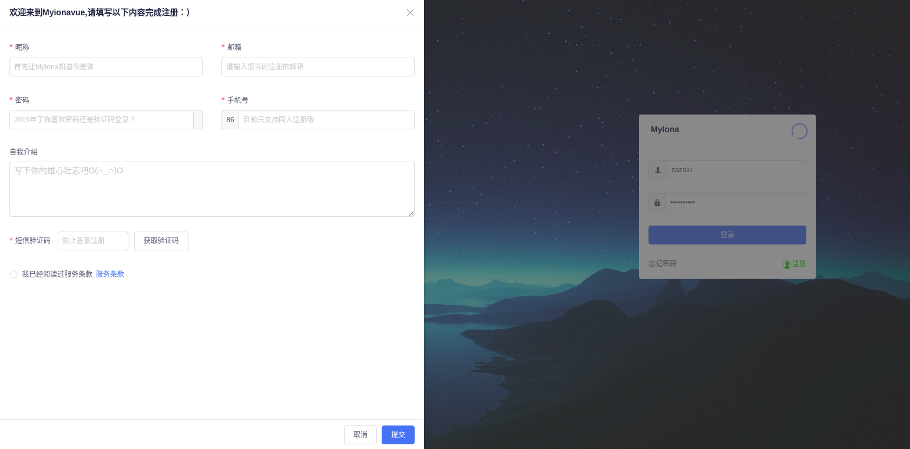
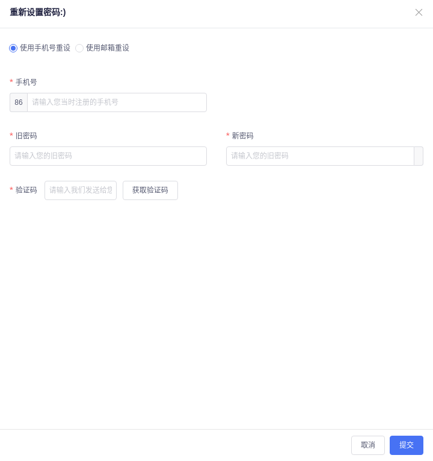
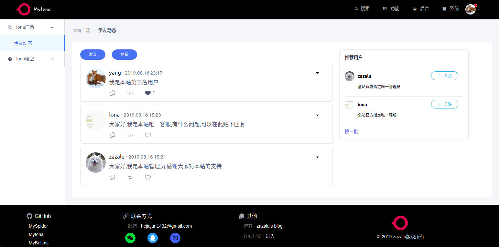
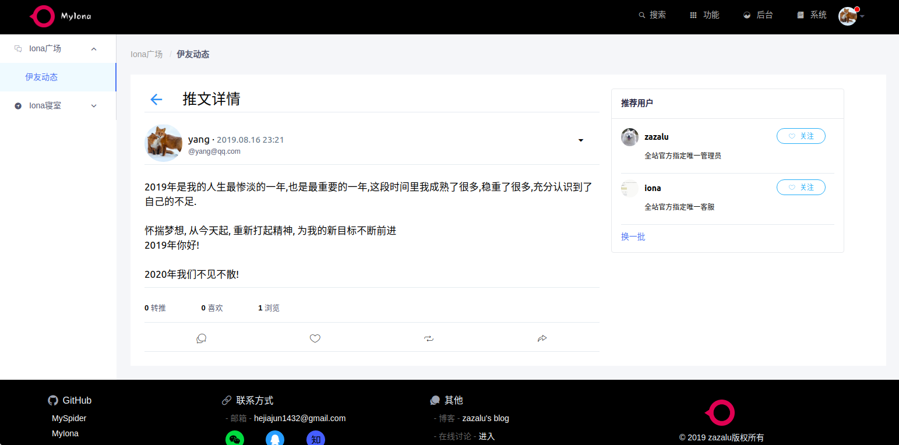
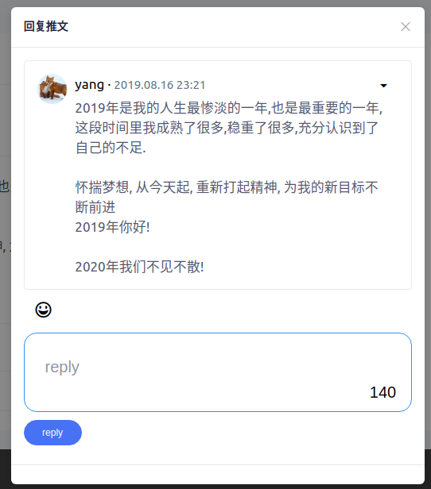
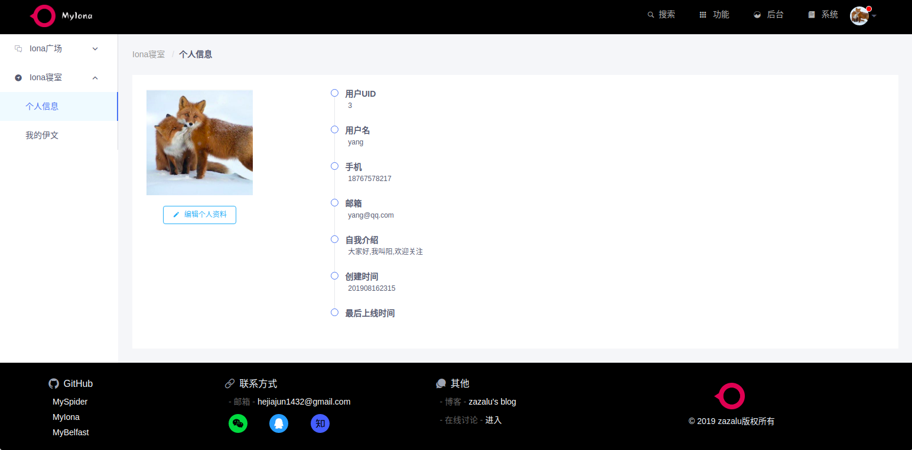
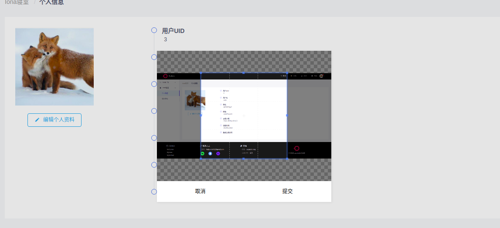
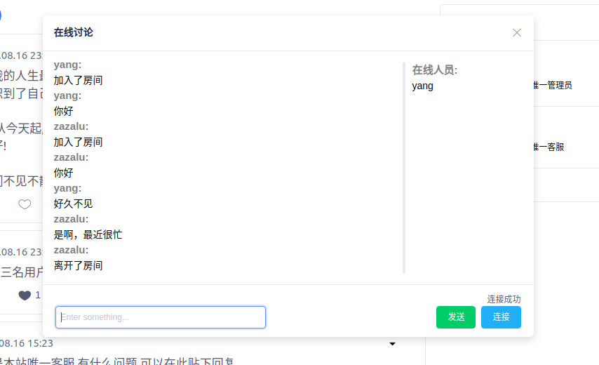
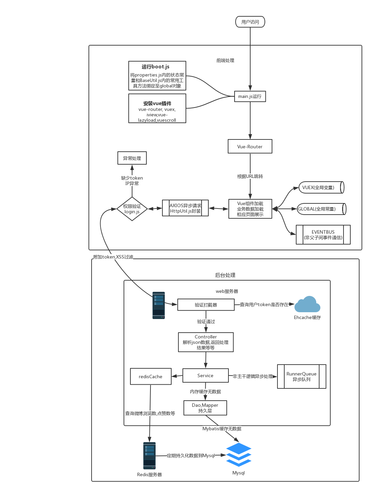

# MyIona

<a title="Hits" target="_blank" href="https://github.com/b3log/hits"></a>

这是我业余时间写好的JavaWeb项目, 一个简单的微博系统, 可以发博,点赞,转发,评论,同时拥有在线聊天,实时通知系统

详细的项目说明可以见,[在线项目说明](http://47.111.146.215:8080/MyIona/tos?_blank)

本项目已经部署在阿里云,[项目地址](http://47.111.146.215:8080/MyIona)

# 项目效果图

## 登录页


## 注册页



## 忘记密码



## 首页



## 博文详情



##　回复博文



## 个人信息浏览



## 头像修改



## 聊天室



# 项目流程图



# 部署步骤

## 1 准备SpringBoot可执行jar包

可以直接下载war/my-iona-0.0.1-prod.jar

或者自己从源代码构建新的jar包,步骤如下：

1. git clone

2. 导入本项目到您本地的IDE工具中，推荐IDEA

3. 根据自身情况选择在`application.properties`中调整开发模式还是生产模式, `spring.profiles.active`属性进行控制

4. 使用IDE工具重新编译

5. 使用maven的package指令打包,默认的,会在target/下得到my-iona-0.0.1-SNAPSHOT.jar文件, 即新的jar包(若package指令报错,应该是你没有搭建并运行本地的redis, 因为本项目使用了redis,springBoot启动的时候会进行连接测试, 可以查看本手册的第7部分查看部署redis方式, [redis部署](#7-Redis部署))

如果你想更改前端内容, 请前往[MyIona-Vue](https://github.com/zazaluMonster/MyIona-Vue)项目查看并按照说明进行修改,最后导出dist文件夹内容复制到resource/static目录下即可

**[注意]**: 我已经帮你们准备好了两种jar包,一个是my-iona-0.0.1-dev.jar,这是测试环境使用的, 适合本地跑. 另一个是my-iona-0.0.1-prod.jar, 这是生产环境使用的(生产环境ip变动则此jar包无效,请自行重新编译). 

## 3 准备一台云服务器

1. 推荐从阿里云购买一台配置最低的轻量级应用服务器

2. 节点选择离自己最近的位置

3. 系统镜像推荐选择CentOS，不过我为了和本地开发环境一致防止出现一些小问题，选择的是Ubuntu18.04

购买完成后，我们必须做一些基本的配置

1. 设置root密码或者密钥

2. 使用ssh工具测试是否能连接

3. 添加防火墙设置，将8080端口放行

## 4 登录我们的云服务器并上传jar包

1. 执行`ssh root@云服务器公网ip地址`登录我们的云服务器终端

2. 在当前用户home目录下，创建目录`spring-boot-jar`

3. 执行`scp /path/to/my-iona-0.0.1-prod.jar root@云服务器公网ip地址:~/spring-boot-jar`，将我们的可执行jar包传至云服务器

## 5 安装jdk或者jre

如果你比较懒！那么请和我一样使用apt安装java，它会帮我们自动完成java_home等一些环境变量的创建

1. 执行`ssh root@云服务器公网ip地址`登录我们的云服务器终端

2. 执行`sudo apt update`，将更新apt，若不更新可能会在安装java包的时候出错

3. 执行`sudo apt install openjdk-8-jdk`，由于java8后都是收费的，为了减少不必要的麻烦，我们安装openjdk即可，目前来看两者没有什么区别

## 6 mysql环境部署

mysql环境部署

1. 安装mysql8.x
https://zazalu.space/2019/06/14/ubuntu18-04%E5%AE%89%E8%A3%85mysql8-0-16-Community/

2. 创建一个zazalu的mysql用户，由于我的数据库配置中使用了zazalu用户进行登录，所以需要创建一个叫zazalu的用户

```
1) 先使用root账户进行登录 
mysql -u root -p 

2) 在mysql交互界面使用如下面指令创建zazalu用户，并给予它所有权限
create user 'zazalu'@'localhost' identified by '!密码!'
GRANT ALL ON *.* TO 'zazalu'@'localhost';

```

3. 上传`sql/MyIona.sql`和`sql/MyIona_data.sql`至云端,这是本系统运行的初始测试数据

4. 依次执行这两个sql
```
在mysql控制台执行
mysql>source /path/MyBelfast.sql
```

## 7 Redis部署

> 安装redis
1. 下载redis最新压缩包
`wget http://download.redis.io/releases/redis-5.0.5.tar.gz`

2. 解压缩
`tar xzf redis-5.0.5.tar.gz`

3. 进入redis-5.0.5目录, `cd redis-5.0.5/`

4. 执行`make`,进行编译

5. 创建一个软连接,这样我们可以方便进行版本更替

```
ln -s ~/redis-5.0.5 ~/redis
```

6. 环境变量配置

```
vim ~/.bashrc 
```
在.bashrc文件末尾添加
```
# redis
export PATH=$PATH:~/redis/src
```

保存后执行source指令使其生效
```
source ~/.bashrc
```

6. 修改配置文件

进入redis/src, 打开redis.conf文件

修改`timeout`从0修改到30
修改`deamonize`从no改为yes, 这样就可以守护线程启动

7. 启动redis

```
redis-server /path/to/redis.conf
```

## 启动项目

进入~/spring-boot-jar

执行指令
```s
//非守护线程
java -jar /path/to/my-iona-0.0.1-prod.jar


//守护线程启动, 把输出全部记录至spring-boot-log/my-iona-0.0.1-prod.log
nohup java -jar /path/to/my-iona-0.0.1-prod.jar >spring-boot-log/my-iona-0.0.1-prod.log &
```

## 关闭项目

1. 执行`ps -ef|grep java`,获得PID

2. 执行`kill -15 PID` ,注意不能用-9, 因为SpringBoot关闭时会进行一些清理操作


# 附录

## 我是如何从SSM升级到SpringBoot

1. 使用SpringInitializr创建一个空的SpringBoot-Web项目模板

2. 拷贝所有SSM项目业务代码全部复制到根包下，然后修复下IDE的报错内容

3. 将SSM的所有xml配置，依次使用Java配置类去实现（全局事务的配置会难一点，不过已解决）

4. 启动项目查看其他报错，并依次解决

5. vue的东西全部放在static/文件夹下即可